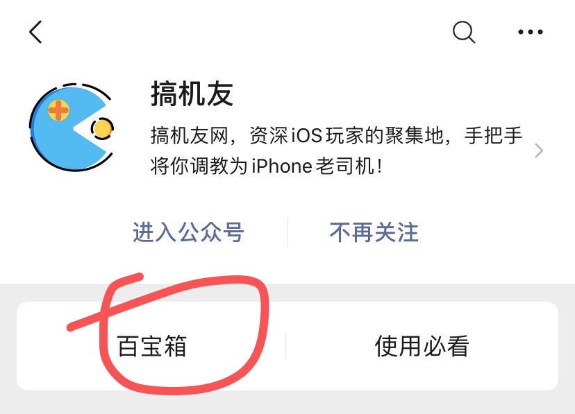
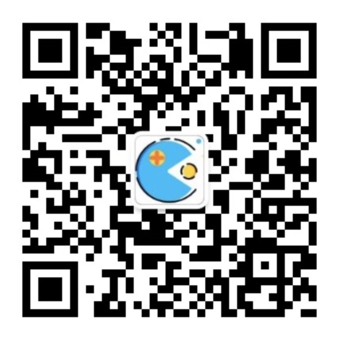
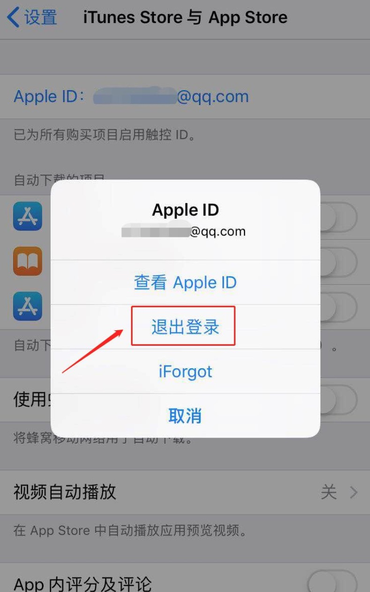

美区苹果ID分享+不越狱安装ios小火箭Shadowrocket方法，持续更新中....

### 最近更新：
> 2020年4月19日

### 特别提醒：
禁止登录iCloud，账号只能用于登录App Store苹果市场！  
为了防止id账号密码滥用，通过公众号获取苹果id！

### 获取方式：
**扫码或搜索关注公众号“搞机友”，点击“百宝箱”，搜索“美”获取共享账号**
共享账号长期保持更新，放心使用。
 
 

### 独享账号及已充值共享号
如果需要购买付费应用，可以点击这里 [https://w.url.cn/s/A071vZB](https://w.url.cn/s/A071vZB) 获取独享账号，自行购买。

### Shadowrocket安装

目前安装Shadowrocket最简单的方法就是使用已充值的美区id登录苹果商店下载，方便快捷，不用越狱。

下面就介绍一下美区id的详细操作步骤。

使用美区已经购买的id登录下载安装(id持续更新)：

1.首先在手机的“设置”找到itunes store与app store选择退出登录，切记按照下图步骤退出App Store苹果市场，**共享账号禁止登录iCloud**。  

 

2.登录下面提供的账号，然后打开App Store进去搜索Shadowrocket  
请不要使用已购账号购买任何其他免费或付费的 APP，以及任何订阅项目！使用已购账号下载完付费项目后请及时退出账号换回自己的 Apple ID。  
（后续 APP 更新也不需要重新登录账号，苹果只要求输入密码验证）
